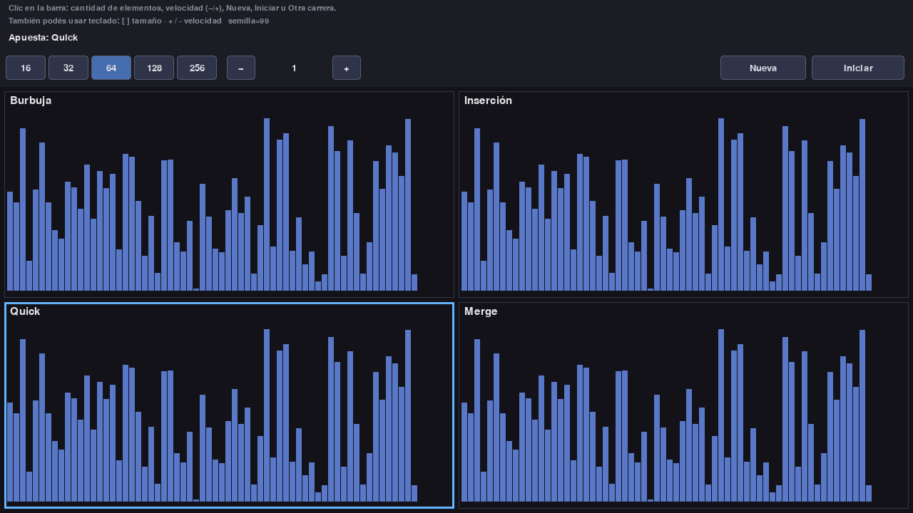
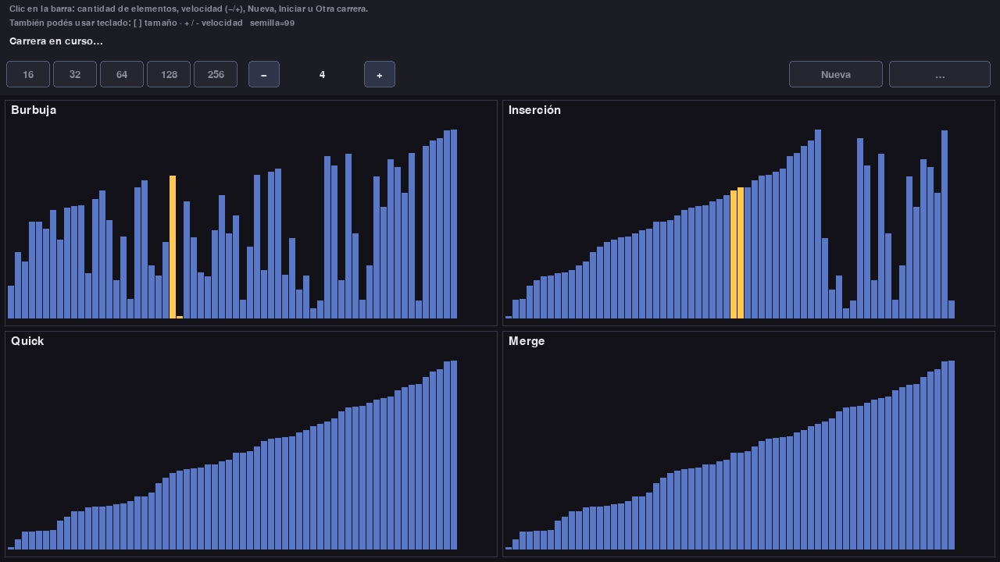
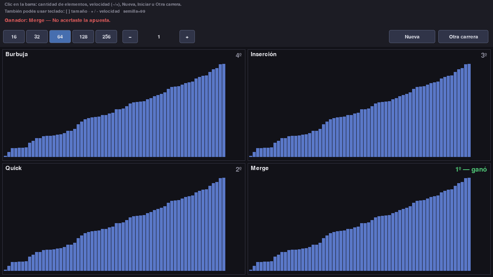
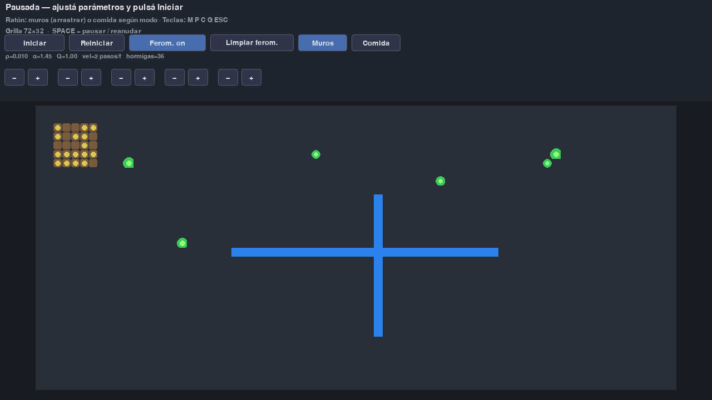
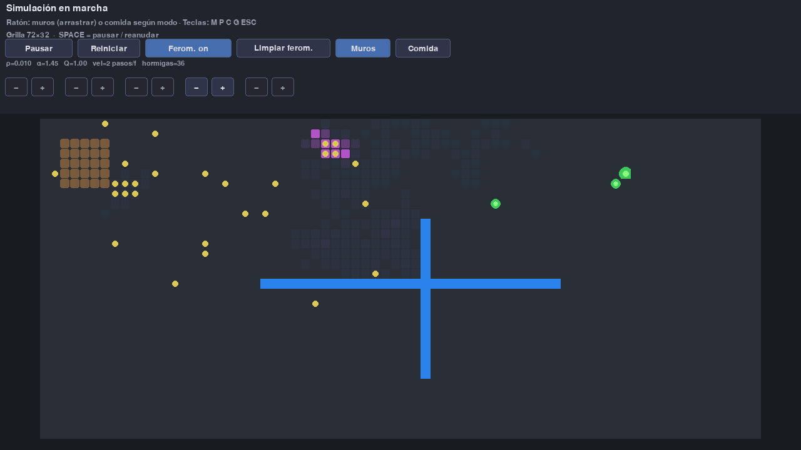
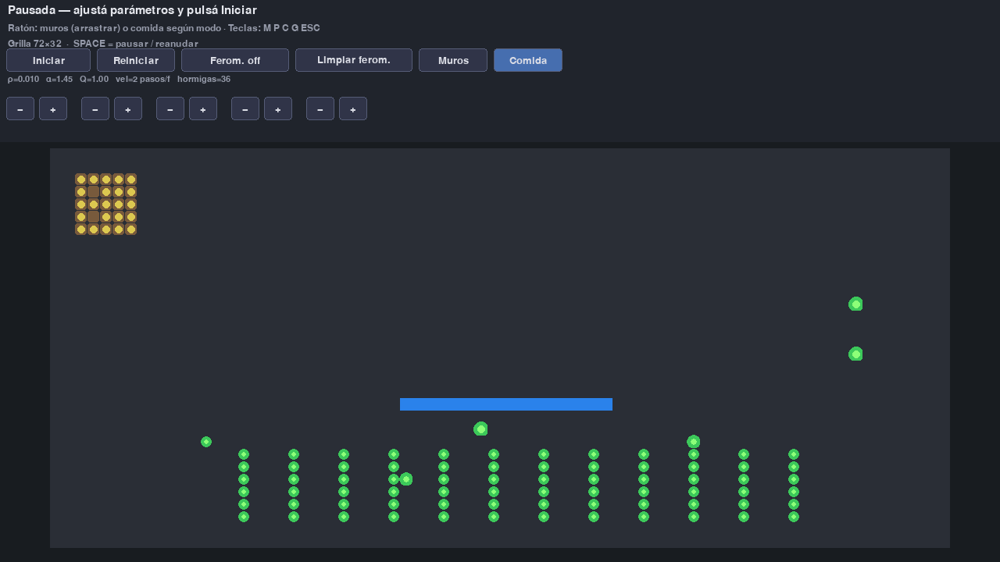
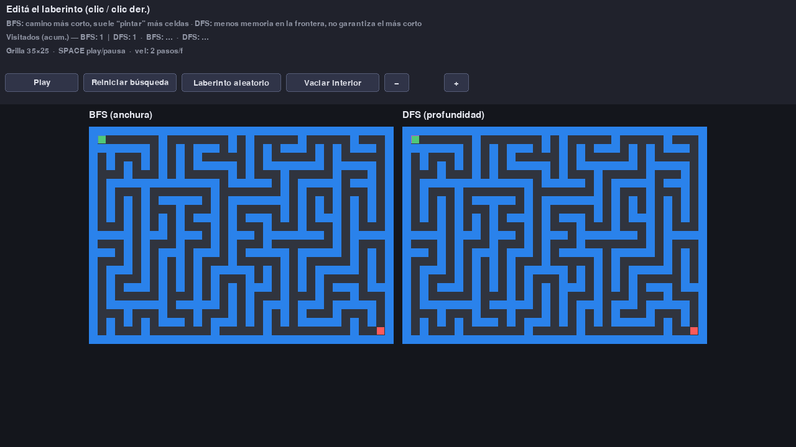
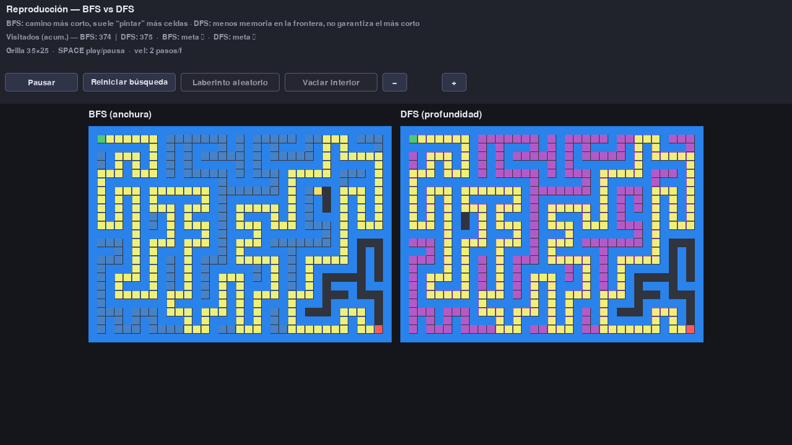
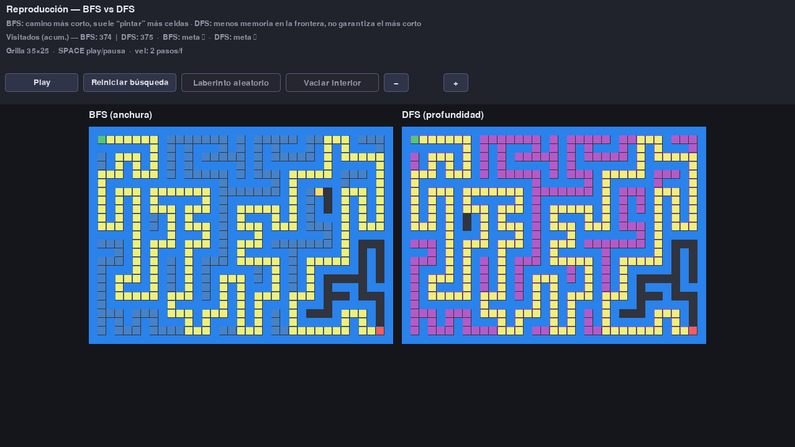

# Prueba-de-Algoritmos

Repositorio de experimentos y demos de algoritmos en **Python**, con **Pygame** y gestión de entornos con **[uv](https://docs.astral.sh/uv/)**.

## Índice

1. [Sorting Race: carrera de ordenamientos](#sorting-race-carrera-de-ordenamientos)
2. [Hormigas: feromonas y comida](#hormigas-feromonas-y-comida)
3. [Laberinto de los vecinos: BFS vs DFS](#laberinto-de-los-vecinos-bfs-vs-dfs)

---

## Sorting Race: carrera de ordenamientos

Cuatro algoritmos (burbuja, inserción, quicksort y mergesort) compiten ordenando la **misma** permutación inicial; podés apostar cuál termina primero y ajustar tamaño y velocidad desde la interfaz (botones y teclado).

### Requisitos

- [uv](https://docs.astral.sh/uv/) instalado
- Python 3.11+ (lo fija el proyecto)

### Cómo ejecutar

```bash
cd Sorting_race
uv sync
uv run sorting-race
```

Alternativa:

```bash
uv run python -m sorting_race
```

Opciones de línea de comandos:

```bash
uv run sorting-race --n 128 --seed 42
```

- `--n`: cantidad de barras (entre 2 y 512; también con botones del HUD).
- `--seed`: semilla para repetir la misma permutación en otra máquina o clase.

### Controles rápidos (Sorting Race)

| Acción | Teclado / interfaz |
|--------|---------------------|
| Iniciar carrera | **SPACE** o botón **Iniciar** |
| Nueva permutación | **R** o **Nueva** |
| Apuesta | **1–4** o clic en un cuadrante (en fase apuesta) |
| Tamaño (presets) | **[** / **]** o botones numéricos del HUD |
| Velocidad (pasos por frame) | **+** / **−** o botones **+** / **−** |
| Salir | **ESC** |

### Capturas (Sorting Race)

**Fase de apuesta** — mismos datos en los cuatro cuadrantes; apuesta opcional (ejemplo: Quick seleccionado).



**Durante la carrera** — cada algoritmo avanza por pasos; los resaltados muestran comparaciones / pivote según el método.



**Resultado** — orden de llegada y mensaje si la apuesta acertó o no.



### Regenerar capturas (Sorting Race)

```bash
cd Sorting_race
uv run python scripts/capture_readme_screenshots.py
```

Usa el driver de vídeo `dummy` de SDL y no abre ventana.

---

## Hormigas: feromonas y comida

Demo **bioinspirada** (idea de colonias de hormigas / ACO didáctico): muchas hormigas buscan comida en una grilla, depositan **feromonas** al volver al nido y las feromonas **se evaporan**. Podés pintar **muros** (azules), añadir **comida** (verde), ajustar **parámetros** en el panel y **iniciar o pausar** la simulación cuando quieras.

Documentación detallada: [Hormigas/README.md](Hormigas/README.md).

### Idea y parámetros (resumen)

| Parámetro | Rol breve |
|-----------|------------|
| **ρ (rho)** | Evaporación: cuánto “se borra” la feromona por frame (más alto → se olvidan antes los viejos caminos). |
| **α (alpha)** | Sensibilidad a feromonas al forrajear (más alto → más tendencia a seguir rastros). |
| **Q** | Cuánta feromona se deposita al volver con comida (más alto → refuerzo más fuerte del camino). |
| **Velocidad** | Pasos de simulación por fotograma (solo ritmo visual, no es biología). |
| **Cantidad de hormigas** | Más agentes → más exploración y refuerzo en paralelo. |

Al abrir el juego la simulación arranca **en pausa**: configurá, dibujá el escenario y pulsá **Iniciar**.

### Cómo ejecutar (Hormigas)

```bash
cd Hormigas
uv sync
uv run hormigas
```

Opciones:

```bash
uv run hormigas --ants 48 --seed 7
```

### Controles rápidos (Hormigas)

| Acción | Dónde |
|--------|--------|
| Iniciar / Pausar | Botón o **SPACE** |
| Reiniciar escenario | Botón o **R** |
| Ajustar ρ, α, Q, velocidad, hormigas | Botones **− / +** del HUD (ρ, α, Q y hormigas solo en **pausa**; la velocidad también en marcha) |
| Muros / comida | Botones **Muros** / **Comida** + ratón en la grilla |
| Ver u ocultar feromonas | Botón o **P** |
| Limpiar feromonas | Botón o **C** |
| Salir | **ESC** |

### Capturas (Hormigas)

**Pausa y panel** — simulación detenida, parámetros visibles y ejemplo de muros azules.



**Simulación con feromonas** — tras unos segundos de actividad, se aprecian los rastros (violeta) y las hormigas.



**Muros y comida** — modo comida y obstáculos para discutir recálculo de rutas en clase.



### Regenerar capturas (Hormigas)

```bash
cd Hormigas
uv run python scripts/capture_readme_screenshots.py
```

---

## Laberinto de los vecinos: BFS vs DFS

Mismo laberinto en **dos paneles**: a la izquierda **BFS (anchura)** y a la derecha **DFS (profundidad)**. Las celdas **visitadas** y la **frontera** (cola vs pila) se pintan con colores distintos; el HUD muestra cuántas celdas llevó cada uno (idea de **memoria** / espacio) y si llegaron a la **meta** (salida). Podés **dibujar muros** con el ratón (clic izquierdo / derecho para borrar), generar un laberinto aleatorio o vaciar el interior, y dar **Play** cuando quieras comparar.

Detalle y controles: [LaberintoVecinos/README.md](LaberintoVecinos/README.md).

### Idea pedagógica (resumen)

| Tema | BFS | DFS |
|------|-----|-----|
| Frontera | Cola: se expande en “olas” | Pila: se mete por un camino y retrocede |
| Camino a la meta | **Más corto** (en pasos, grafo no ponderado) | **No garantizado** el más corto |
| “Pintura” / visitados | Suele **marcar más** celdas hasta la meta | A menudo **menos** frontera abierta, pero el recorrido puede ser largo |

### Cómo ejecutar (Laberinto)

```bash
cd LaberintoVecinos
uv sync
uv run laberinto-vecinos
```

Opción:

```bash
uv run laberinto-vecinos --seed 42
```

### Controles rápidos (Laberinto)

| Acción | Dónde |
|--------|--------|
| Play / Pausar | Botón o **SPACE** |
| Reiniciar solo la búsqueda | Botón (mantiene el laberinto) |
| Laberinto aleatorio / vaciar interior | Botones (solo en **modo edición**) |
| Velocidad | **− / +** en el HUD |
| Pared | Clic izquierdo en celda (edición) |
| Quitar pared | Clic derecho |
| Salir | **ESC** |

### Capturas (Laberinto)

**Edición** — laberinto generado y panel listo para modificar o dar Play.



**En carrera** — ambas búsquedas avanzando; se nota la expansión ancha del BFS frente al trazo del DFS.



**Resultado** — meta alcanzada (o no) y camino resaltado cuando hay éxito.



### Regenerar capturas (Laberinto)

```bash
cd LaberintoVecinos
uv run python scripts/capture_readme_screenshots.py
```

---

## Requisitos comunes

- [uv](https://docs.astral.sh/uv/)
- Python **3.11+** en cada subcarpeta del proyecto (`Sorting_race`, `Hormigas`, `LaberintoVecinos`).
